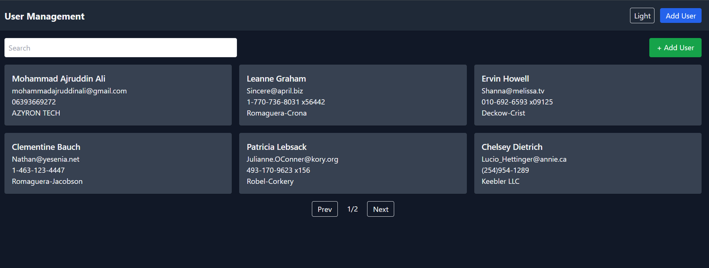

 # 🧩 User Management Dashboard

A simple and responsive **User Management Dashboard** built using **React.js**, **Vite**, and **Tailwind CSS**.  
This project demonstrates core React concepts such as **component-based architecture**, **state management**, **routing**, and **API integration**.

---

## 🚀 Features

- 📋 Display list of users from API  
- 🔍 Search users by name or email  
- 👤 View user details on a separate page  
- ➕ Add new users (stored locally)  
- 📱 Fully responsive UI using Tailwind CSS  
- 🌗 Clean, modern, and extendable code structure

---

## 🧠 Tech Stack

| Technology | Description |
|-------------|-------------|
| **React.js** | UI library for building components |
| **Vite** | Fast and modern frontend build tool |
| **Tailwind CSS** | Utility-first CSS framework for styling |
| **React Router DOM** | Client-side routing for multiple pages |
| **Axios** | Promise-based HTTP client for API calls |

---

## 🛠️ Installation and Setup

Follow these steps to run the project locally:

### 1️⃣ Clone this repository
```bash
git clone https://github.com/ajruddinpw/User-management-dashboard/blob/main/README.md
  
  2️⃣ Navigate into the folder
cd user-management-dashboard

3️⃣ Install dependencies
npm install

4️⃣ Run the development server
npm run dev

5️⃣ Open in browser

The app will run at http://localhost:5173


🧱 Project Structure
user-management-dashboard/
├── node_modules
├── screenshots
│       └── home_page.png
├── src/
│   ├── api/
│   │   └── userService.js
│   │    
│   ├── pages/
│   │   ├── AddUser.jsx
│   │   ├── Home.jsx
│   │   └── UserDetails.jsx
│   ├── router/
│   │      └── AppRouter.jsx
│   ├── App.jsx
│   ├── main.jsx
│   └── index.css
├── .gitignore
├── index.html
├── package-lock.json
├── package.json
├── postcss.config.cjs
├── README.md 
├── tailwind.config.js
└── vite.config.js

💡 Bonus Features (Ideas)

🌓 Dark / Light theme toggle

🔁 Pagination or infinite scrolling

💾 LocalStorage persistence for added users

🔔 Toast notifications for feedback

📸 Screenshots 


### 🏠 Home Page

 

🧑‍💻 Author

Mohammad Ajruddin Ali